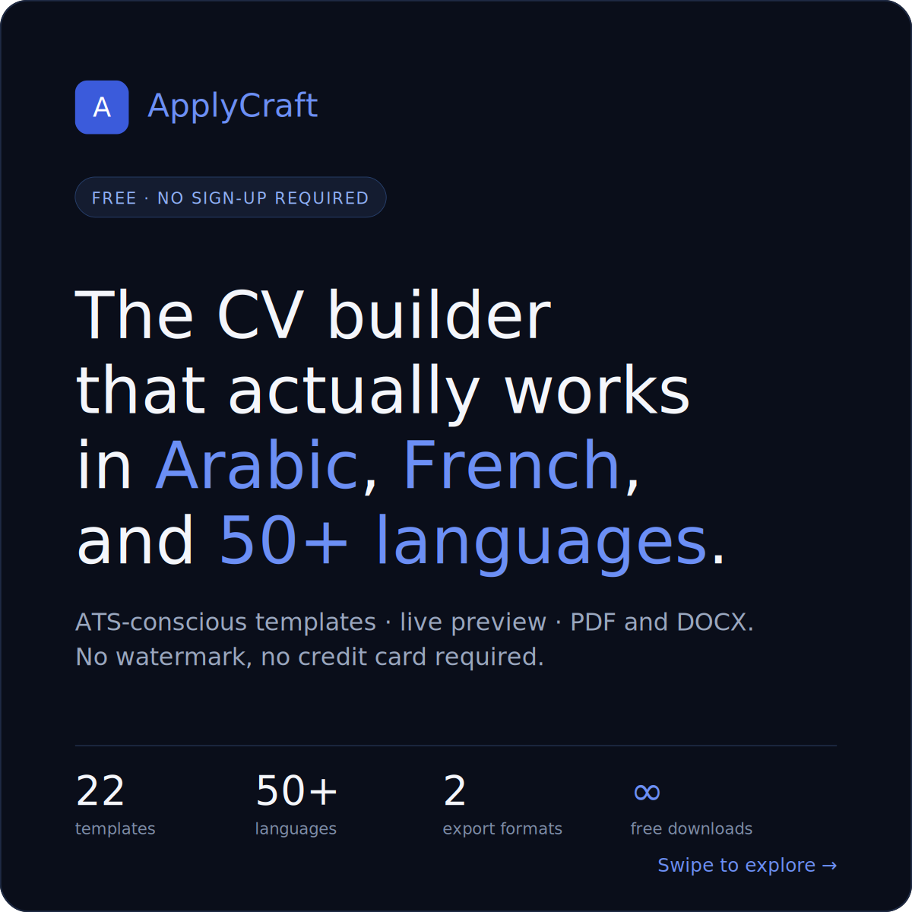
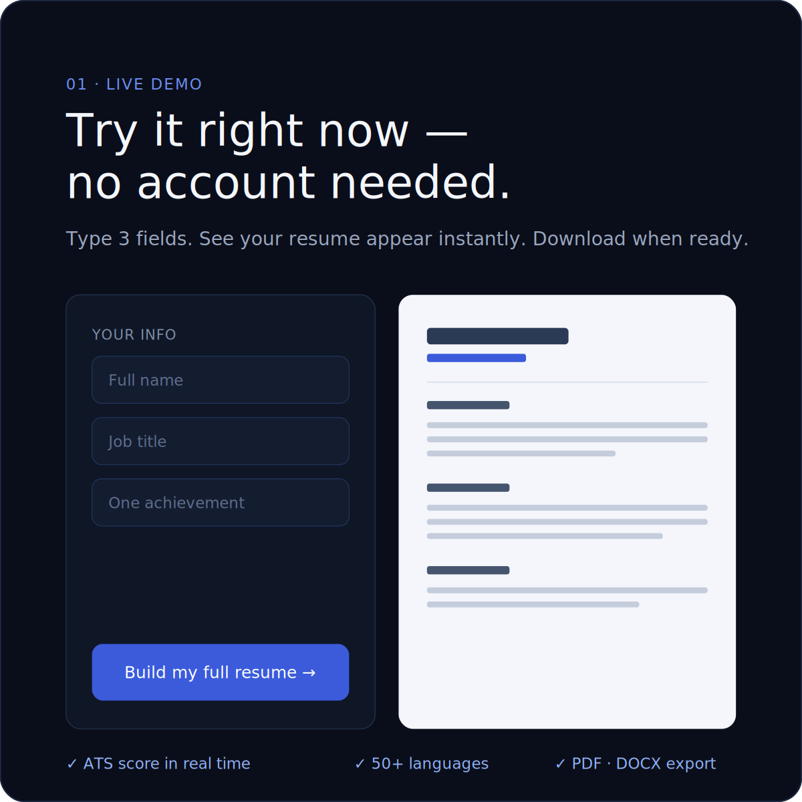
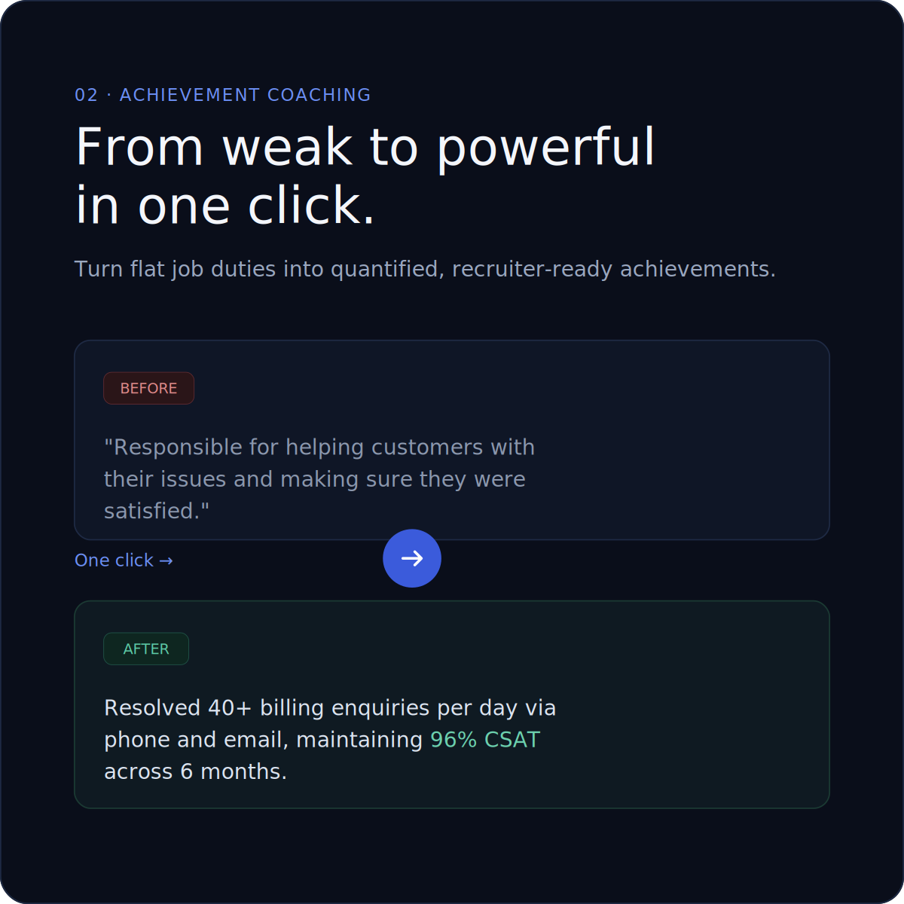
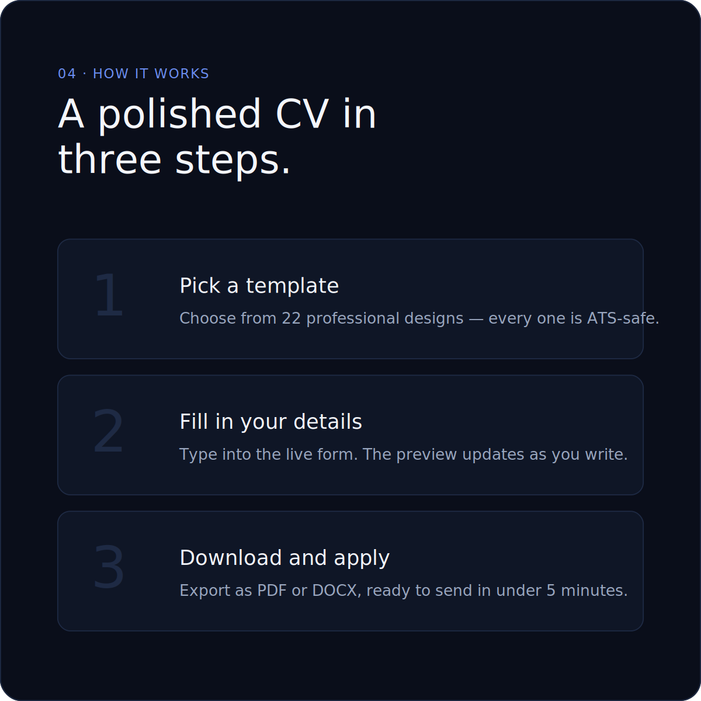
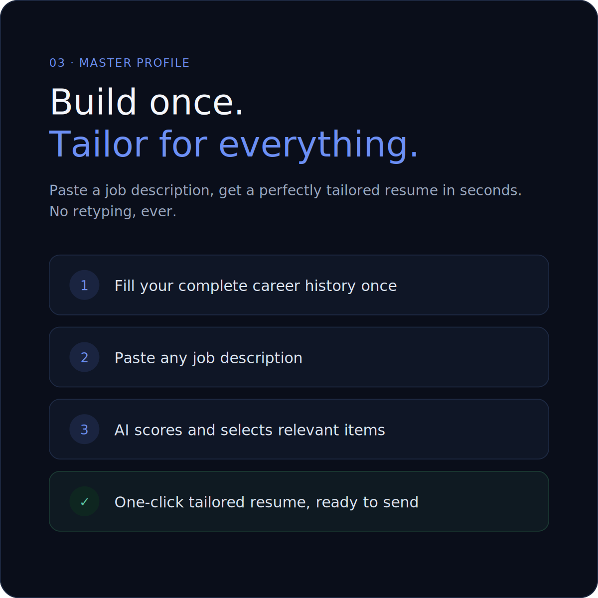
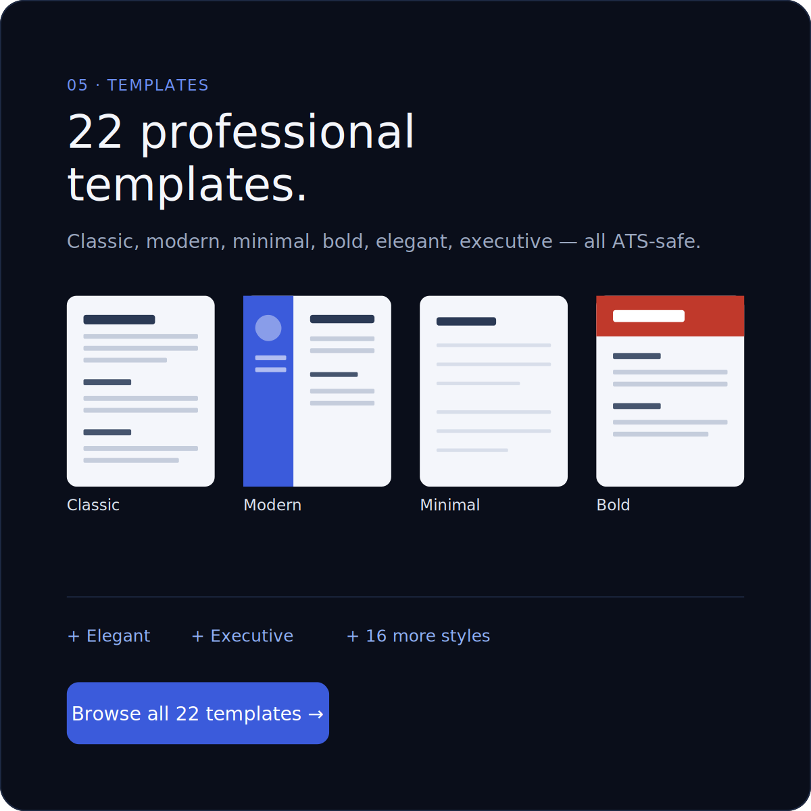
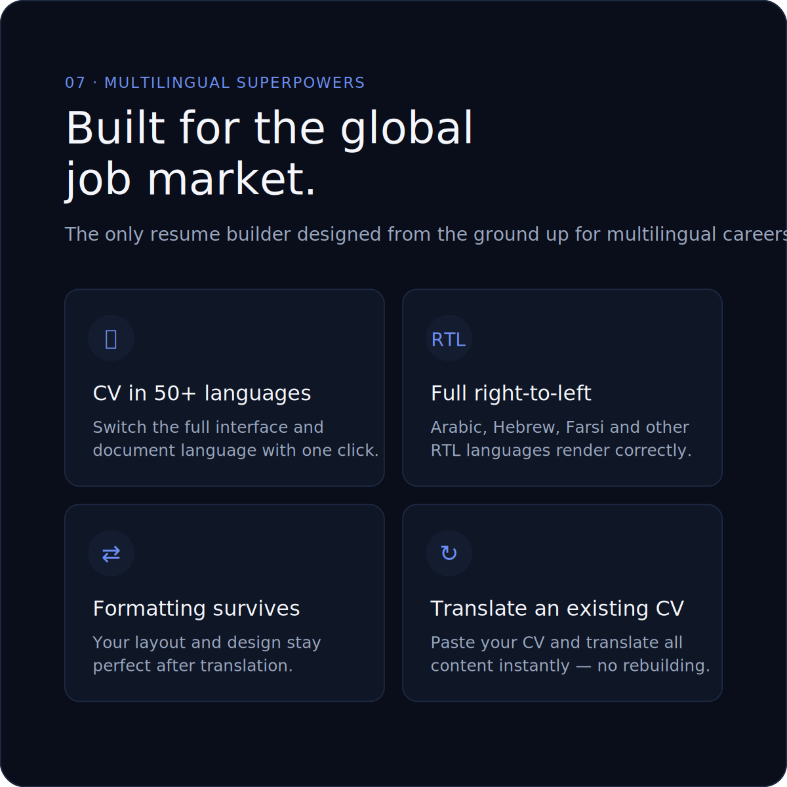
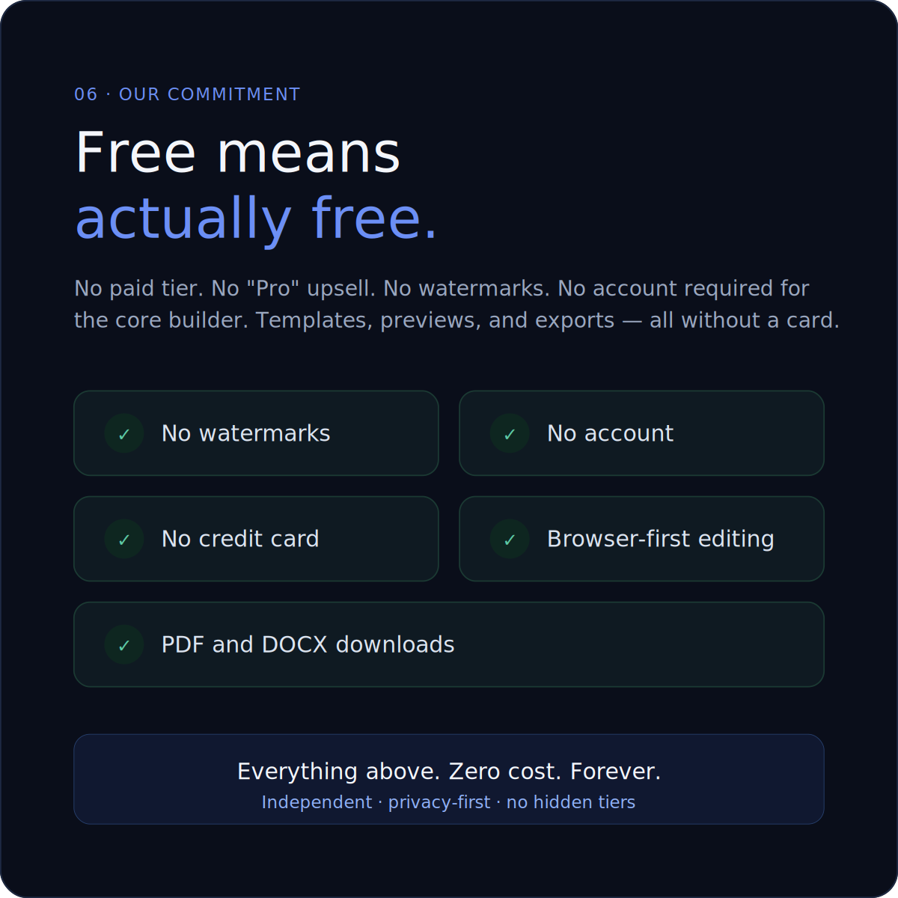
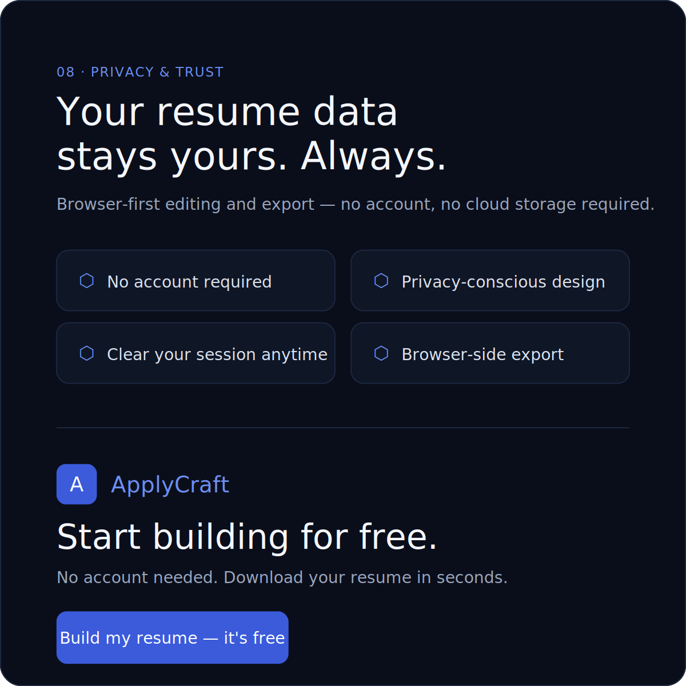

<div align="center">



<br/>

**The CV builder that actually works in Arabic, French, and 50+ languages.**

ATS-conscious templates · live preview · PDF and DOCX · no watermark · no credit card required.

[](https://applycraft.io)
[](LICENSE)
[](https://vitejs.dev)
[](https://pages.cloudflare.com)

</div>

---

## What is ApplyCraft?

ApplyCraft is a free, privacy-first resume and cover letter builder built for the global job market. No account. No watermark. No paywall. Just open the browser, pick a template, fill in your details, and download a polished PDF or DOCX in under 5 minutes.

**22 templates · 50+ languages · ∞ free downloads**

---

## Features at a glance

<table>
<tr>
<td width="50%">

### 01 · Live demo — no account needed



Type 3 fields. See your resume appear instantly. Download when ready.

Real-time preview updates as you type. ATS score shown live. Export to PDF or DOCX with one click.

</td>
<td width="50%">

### 02 · Achievement coaching



**From weak to powerful in one click.**

Paste a flat job duty and ApplyCraft rewrites it into a quantified, recruiter-ready bullet — complete with metrics, impact, and strong action verbs.

> **Before:** *"Responsible for helping customers with their issues and making sure they were satisfied."*
>
> **After:** *"Resolved 40+ billing enquiries per day via phone and email, maintaining 96% CSAT across 6 months."*

</td>
</tr>
</table>

---

## How it works

<div align="center">

</div>

<br/>

| Step | What you do | What happens |
|------|-------------|--------------|
| **1 · Pick a template** | Browse 22 professional designs | Every template is ATS-safe and fully responsive |
| **2 · Fill in your details** | Type into the live form | The preview updates in real time as you write |
| **3 · Download and apply** | Click Export | PDF or DOCX — ready to send in under 5 minutes |

---

## Master Profile — build once, tailor for everything

<div align="center">

</div>

<br/>

Stop retyping your CV for every job. With the Master Profile workflow:

1. **Fill your complete career history once** — all roles, projects, skills, and achievements
2. **Paste any job description** — from any job board or company site
3. **AI scores and selects relevant items** — ranked by fit for that specific role
4. **One-click tailored resume, ready to send** — no retyping, ever

---

## 22 professional templates

<div align="center">

</div>

<br/>

Classic · Modern · Minimal · Bold · Elegant · Executive — and 16 more styles.

Every template is:
- **ATS-safe** — structured for automated parsing, no tables or text boxes that break parsers
- **Print-ready** — precise margins, clean typography, correct page breaks
- **RTL-aware** — layouts mirror automatically for Arabic, Hebrew, Farsi

---

## Multilingual superpowers

<div align="center">

</div>

<br/>

ApplyCraft is the only resume builder designed from the ground up for multilingual careers.

| Feature | Detail |
|---------|--------|
| **CV in 50+ languages** | Switch the full interface and document language with one click |
| **Full right-to-left** | Arabic, Hebrew, Farsi and other RTL languages render correctly |
| **Formatting survives** | Your layout and design stay perfect after translation |
| **Translate an existing CV** | Paste your CV and translate all content instantly — no rebuilding |

---

## Free means actually free

<div align="center">

</div>

<br/>

- No watermarks
- No account required
- No credit card
- No paid tier or "Pro" upsell
- Browser-first editing — your data never leaves your machine
- PDF and DOCX downloads included

**Everything above. Zero cost. Forever.**

---

## Privacy & trust

<div align="center">

</div>

<br/>

- **No account required** — nothing to sign up for, nothing to leak
- **Privacy-conscious design** — no analytics on resume content
- **Browser-side export** — PDF and DOCX generated in your browser, never uploaded
- **Clear your session anytime** — one click wipes everything locally

---

## Tech stack

| Layer | Technology |
|-------|------------|
| Framework | React 18 |
| Build tool | Vite 6 + vite-react-ssg (static prerendering) |
| Styling | CSS-in-JS + shared `_seo.css` for static pages |
| PDF export | jsPDF (lazy-loaded) |
| DOCX export | docx.js (lazy-loaded) |
| HTML sanitisation | DOMPurify |
| Hosting | Cloudflare Pages |
| CDN | Cloudflare global network |

---

## Run locally

```bash
# 1. Clone
git clone https://github.com/biroue10/applycraft.git
cd applycraft

# 2. Install dependencies
npm install

# 3. Start dev server
npm run dev
# → opens at http://localhost:5173
```

### Build for production

```bash
npm run build      # SSG build → dist/
npm run preview    # serve the dist/ locally
```

The build uses `vite-react-ssg` to prerender the landing page as real HTML so Googlebot can index it without executing JavaScript.

---

## Project structure

```
resume-app/
├── src/
│   ├── main.jsx              # SSG entry point (ViteReactSSG)
│   ├── routes.jsx            # React route definitions
│   └── ResumeGenerator.jsx   # Main app component (~7 000 lines)
├── public/
│   ├── ats-checker/          # Free ATS checker tool (EN)
│   ├── ats-checker-fr/       # Free ATS checker — French
│   ├── ats-checker-ar/       # Free ATS checker — Arabic (RTL)
│   ├── ats-engine.js         # Shared ATS scoring engine
│   ├── resume-in-french/     # French landing page
│   ├── resume-in-arabic/     # Arabic landing page (RTL)
│   ├── examples/             # 8 resume example pages
│   ├── sitemap.xml           # 31 URLs, all priorities set
│   ├── robots.txt            # Sitemap reference, no blocks
│   ├── og.png                # Open Graph image (1200×630)
│   └── _redirects            # Cloudflare Pages SPA fallback
├── docs/
│   └── screenshots/          # Product screenshots for README
├── vite.config.js            # SSG options, hreflang injection
└── package.json
```

---

## SEO

- **Static prerendering** via vite-react-ssg — landing page ships as real HTML
- **Sitemap** covering 31 URLs with priority tiers
- **hreflang clusters** for EN / FR / AR resume builder and ATS checker variants
- **JSON-LD schemas** on every page (WebPage, SoftwareApplication, FAQPage)
- **Core Web Vitals** optimised — jsPDF and html2canvas are lazy-loaded

---

## License

MIT — see [LICENSE](LICENSE).

---

<div align="center">

Built by [Isaac Biroue](https://github.com/biroue10) · [applycraft.io](https://applycraft.io)

</div>
