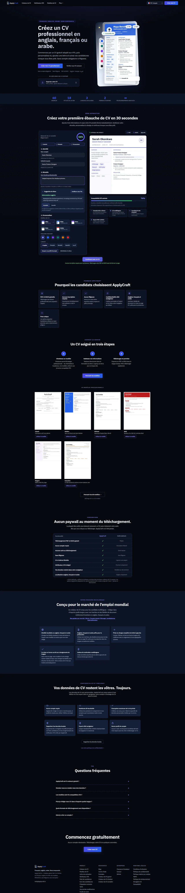
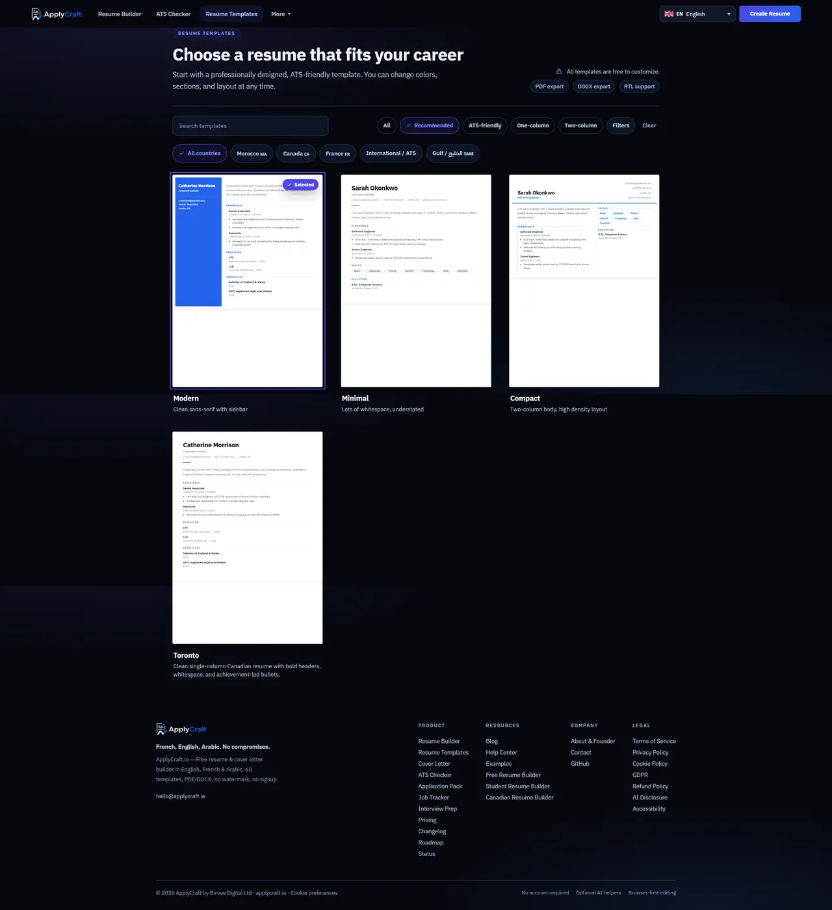
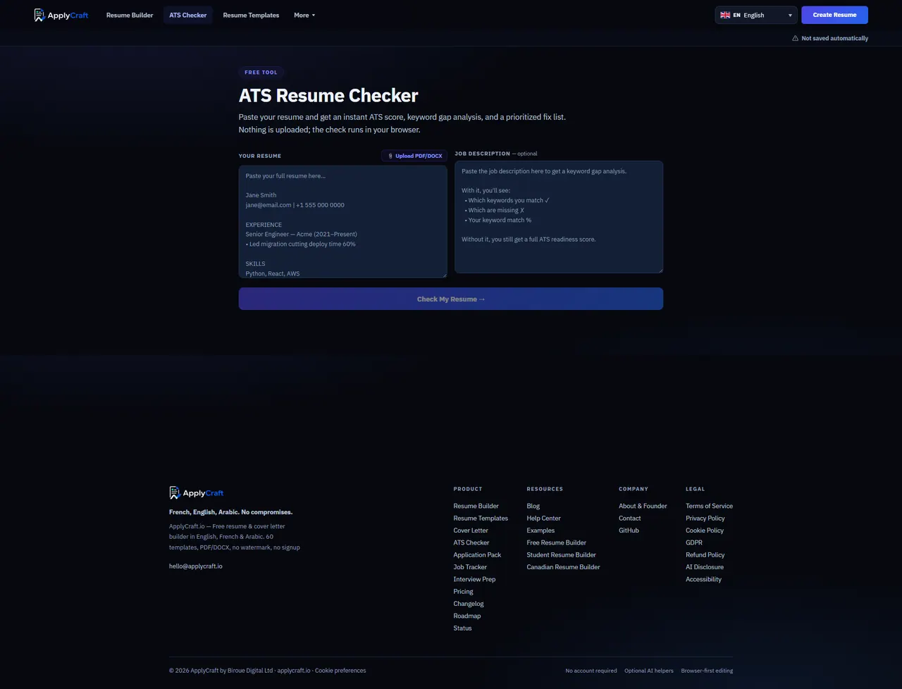
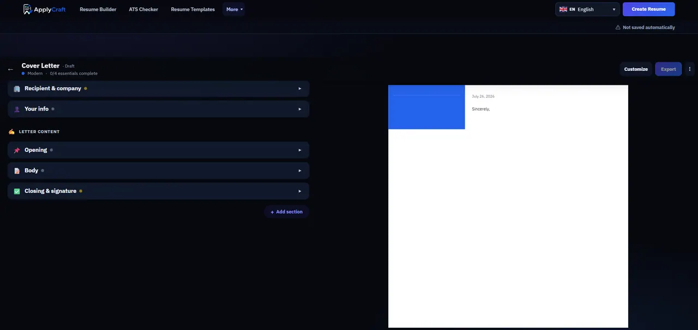
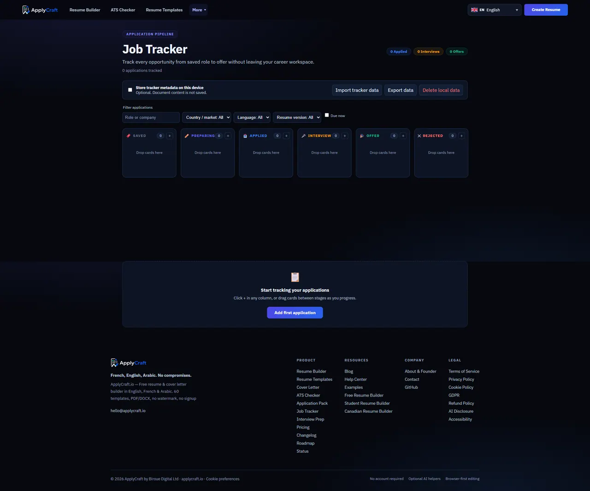
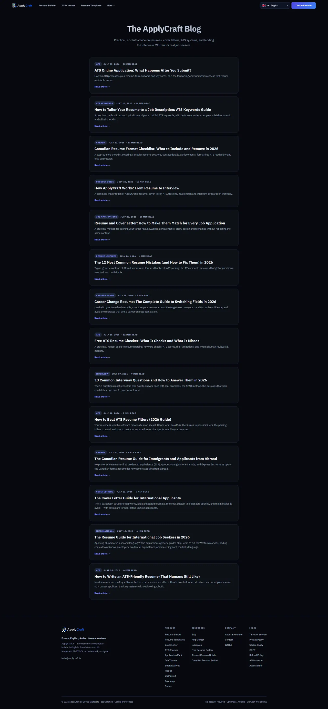
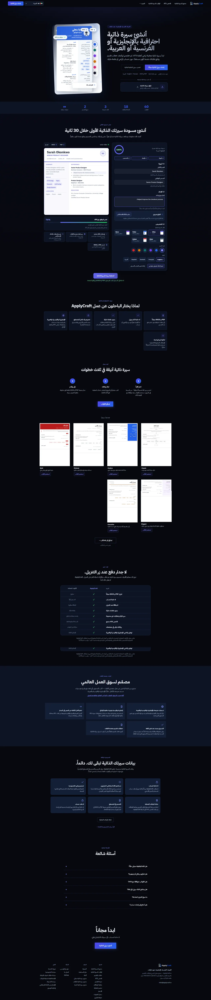
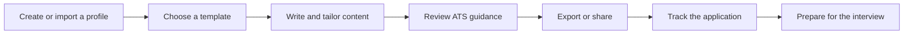

# ApplyCraft

<p align="center">
  <strong>Build, tailor, check, export, and manage job applications from one multilingual workspace.</strong>
</p>

<p align="center">
  <a href="https://applycraft.io/">Live application</a> ·
  <a href="https://applycraft.io/resume-builder/">Resume builder</a> ·
  <a href="https://applycraft.io/ats-checker/">ATS checker</a> ·
  <a href="https://applycraft.io/resume/templates/">Templates</a> ·
  <a href="https://applycraft.io/blog/">Blog</a>
</p>

<p align="center">
  <a href="https://github.com/biroue10/applycraft/actions/workflows/deploy.yml"></a>
  <a href="https://github.com/biroue10/applycraft/actions/workflows/security.yml"></a>
  <a href="LICENSE"></a>
  
</p>



ApplyCraft is a browser-first career workspace for creating professional resumes and cover letters, checking ATS readiness, tracking applications, and preparing for interviews. The production interface supports English, French, and Arabic—including right-to-left layouts—and provides PDF and DOCX exports without requiring an account for the core workflow.

> [!NOTE]
> The ATS checker provides heuristic guidance. It cannot guarantee that a resume will pass a specific employer's ATS or lead to an interview.

## Contents

- [Product overview](#product-overview)
- [Product tour](#product-tour)
- [How the product works](#how-the-product-works)
- [Technology](#technology)
- [Local development](#local-development)
- [Configuration](#configuration)
- [Quality and testing](#quality-and-testing)
- [Internationalization, SEO, and accessibility](#internationalization-seo-and-accessibility)
- [Privacy and security](#privacy-and-security)
- [Deployment](#deployment)
- [Project structure](#project-structure)
- [Contributing and support](#contributing-and-support)

## Product overview

| Area | What it provides | Open |
| --- | --- | --- |
| Resume builder | Guided sections, live preview, styling controls, local drafts, PDF/DOCX export, and sharing | [Build a resume](https://applycraft.io/resume-builder/) |
| Resume templates | 60 customizable templates, with ATS-friendly, one-column, two-column, and market filters | [Browse templates](https://applycraft.io/resume/templates/) |
| ATS checker | Resume structure, completeness, quantification, date, and job-description keyword checks | [Check a resume](https://applycraft.io/ats-checker/) |
| Cover letter builder | Structured recipient, profile, opening, body, closing, and export workflow | [Build a cover letter](https://applycraft.io/cover-letter-builder/) |
| Application pack | Resume and cover-letter variants organized for a specific application | [Open application pack](https://applycraft.io/application-pack/) |
| Job tracker | Kanban workflow from saved role to offer, with filters and local import/export | [Track applications](https://applycraft.io/job-tracker/) |
| Interview preparation | Practice workspace for common questions and structured answers | [Prepare for interviews](https://applycraft.io/interview-prep/) |
| Career content | Practical guidance about resumes, ATS systems, cover letters, and job searches | [Read the blog](https://applycraft.io/blog/) |

Additional localized entry points:

- [English](https://applycraft.io/)
- [Français](https://applycraft.io/fr/)
- [العربية](https://applycraft.io/ar/)
- [French ATS checker](https://applycraft.io/ats-checker-fr/)
- [Arabic ATS checker](https://applycraft.io/ats-checker-ar/)

## Product tour

### Resume templates

Search and filter templates by layout, ATS suitability, recommendation, and target market. A selected design can be customized in the builder.

[](https://applycraft.io/resume/templates/)

### Resume builder

The builder combines guided editing with a live document preview. Users can change content, colors, sections, and layout before exporting to PDF or DOCX.

Core capabilities include:

- reusable profile data and tailored resume versions;
- locally saved drafts;
- PDF and DOCX export;
- short share links with an expiry window;
- private offline links that encode the document in the URL;
- a shared-document viewer with PDF download;
- multilingual content and right-to-left document support.

### ATS checker

The checker can analyze pasted text or an imported PDF/DOCX. Supplying a job description adds a keyword-gap comparison.

[](https://applycraft.io/ats-checker/)

### Cover letter builder

The cover-letter workflow separates the recipient, candidate details, opening, body, and closing so each part can be reviewed independently.

[](https://applycraft.io/cover-letter-builder/)

### Job tracker

Applications move through saved, preparing, applied, interview, offer, and rejected stages. Tracker metadata can remain on the device and can be exported or imported by the user.

[](https://applycraft.io/job-tracker/)

### Blog and career guides

The blog publishes long-form guides for job seekers, including ATS explanations, resume tailoring, Canadian resume formats, interview questions, and application strategy.

[](https://applycraft.io/blog/)

### Responsive and right-to-left experiences

The interface is responsive, and the Arabic experience uses a dedicated right-to-left layout.

<table>
  <tr>
    <td align="center"></td>
    <td></td>
  </tr>
  <tr>
    <td align="center"><strong>Mobile</strong></td>
    <td align="center"><strong>Arabic / RTL</strong></td>
  </tr>
</table>

## How the product works


```mermaid
flowchart LR
    A["Create or import a profile"] --> B["Choose a template"]
    B --> C["Write and tailor content"]
    C --> D["Review ATS guidance"]
    D --> E["Export or share"]
    E --> F["Track the application"]
    F --> G["Prepare for the interview"]
```

The core editor is designed to work without an account:

1. The browser stores the active draft locally.
2. React renders the editor and a live document preview.
3. PDF and DOCX exports are generated from the document data.
4. Optional server-backed features—such as short links, AI helpers, email, accounts, or payments—are isolated behind explicit actions and configuration.

## Technology

| Layer | Main tools |
| --- | --- |
| Front end | React 18, React Router, Vite |
| Static generation | `vite-react-ssg`, generated route pages, sitemap and blog indexes |
| Documents | jsPDF, DOCX, PDF.js, browser print/export utilities |
| Data encoding | `lz-string`, `fflate`, browser storage |
| Edge backend | Cloudflare Worker and KV-backed short links |
| Analytics | Optional Google Analytics and Microsoft Clarity |
| Testing | Playwright, Vitest, jsdom, axe-core, custom SEO and security audits |
| Automation | GitHub Actions, Cloudflare deployment hooks, IndexNow submission |

## Local development

### Requirements

- [Node.js](https://nodejs.org/) 24.x recommended
- npm
- Git

### Install and run

```bash
git clone https://github.com/biroue10/applycraft.git
cd applycraft
npm ci
cp .env.example .env
npm run dev
```

Open the URL printed by Vite, normally `http://localhost:5173`.

On Windows PowerShell, copy the environment file with:

```powershell
Copy-Item .env.example .env
```

### Production build

```bash
npm run build
npm run preview
```

The generated static application is written to `dist/`.

## Configuration

The repository includes [`.env.example`](.env.example). Copy it to `.env` for local development and keep real secrets out of Git.

| Variable group | Purpose | Typical local value |
| --- | --- | --- |
| `VITE_ACCOUNTS_ENABLED` | Legacy account UI switch; resume creation now uses verified passwordless sessions | `false` |
| `VITE_PAYMENTS_ENABLED` | Enables optional payment UI | `false` |
| `VITE_GA_ENABLED`, `VITE_CLARITY_ENABLED` | Enables optional analytics integrations | `false` |
| `VITE_GA_MEASUREMENT_ID`, `VITE_CLARITY_PROJECT_ID` | Public analytics identifiers | blank |
| `ANTHROPIC_API_KEY` | Server-side key for configured AI helpers | blank unless testing AI |
| `RESEND_API_KEY`, `RESEND_FROM_EMAIL` | Required passwordless sign-in email delivery | blank locally |
| `LEMON_SQUEEZY_*` | Optional checkout and webhook configuration | blank |
| `APP_ORIGIN`, `ALLOWED_ORIGINS` | Production URL and Worker origin restrictions | local or production origin |

> [!IMPORTANT]
> Never expose server secrets through `VITE_*` variables. Vite variables are bundled into client-side code.

Short-link and authentication storage use the Cloudflare KV binding in [`wrangler.json`](wrangler.json). Resume creation requires a server-verified session obtained through a one-time email link; public landing pages, templates, blog articles, and the ATS checker remain accessible without signing in. The Worker implementation lives in [`worker.js`](worker.js).

## Quality and testing

The CI pipeline runs build, localization, SEO, accessibility, performance, document, and security checks. Useful commands include:

| Command | Purpose |
| --- | --- |
| `npm run build` | Generate production pages and assets |
| `npm run test:e2e` | Run end-to-end browser tests |
| `npm run test:ats` | Validate ATS scoring behavior |
| `npm run test:free-exports` | Check free PDF/DOCX export paths |
| `npm run test:share` | Verify document sharing |
| `npm run test:i18n` | Check locale integrity |
| `npm run test:a11y` | Run accessibility checks |
| `npm run test:security` | Run repository security tests |
| `npm run validate:seo` | Audit generated SEO output |
| `npm run validate:performance` | Check performance budgets |

Before opening a pull request, run at least:

```bash
npm run build
npm run test:i18n
npm run test:a11y
npm run test:security
npm run validate:seo
```

End-to-end tests may require Playwright browsers:

```bash
npx playwright install
```

## Internationalization, SEO, and accessibility

### Internationalization

- Production UI locales: English, French, and Arabic.
- Arabic pages use right-to-left direction and localized navigation.
- User-authored resume content is not limited to the interface language.
- Locale copy is organized under [`src/i18n`](src/i18n).
- Hardcoded user-facing strings are checked by the i18n guard.

### SEO

The build process generates and validates:

- localized metadata and canonical URLs;
- `hreflang` relationships;
- structured data and breadcrumbs;
- blog and content indexes;
- `robots.txt` and `sitemap.xml`;
- Open Graph assets;
- static HTML for indexable routes.

See the public [sitemap](https://applycraft.io/sitemap.xml) and [robots.txt](https://applycraft.io/robots.txt).

### Accessibility

The project includes automated axe checks, contrast validation, keyboard-oriented navigation, semantic labels, and reduced-motion considerations. Accessibility feedback can be reported through [GitHub Issues](https://github.com/biroue10/applycraft/issues) or the public [accessibility page](https://applycraft.io/accessibility/).

## Privacy and security

ApplyCraft follows a browser-first model for the core editing workflow:

- resume and cover-letter drafts are stored locally by default;
- core PDF/DOCX generation runs from the user's document data;
- account creation is not required for the primary builder;
- analytics are consent-controlled and environment-configurable;
- optional short links store a document copy for the stated retention period;
- optional AI, email, account, and payment features may send only the data needed for the selected action.

Security controls include origin restrictions, rate limits, request-size limits, content security policies, dependency auditing, secret scanning, CodeQL, and automated security tests.

Read the public policies:

- [Privacy policy](https://applycraft.io/privacy/)
- [Cookie policy](https://applycraft.io/cookies/)
- [Terms of service](https://applycraft.io/terms/)
- [AI disclosure](https://applycraft.io/ai-disclosure/)
- [Security policy](SECURITY.md)

## Deployment

Production builds are automated by [`.github/workflows/deploy.yml`](.github/workflows/deploy.yml). A push to `main` triggers the validation pipeline, builds the static application, and runs the configured production update steps, including search-engine notifications.

Cloudflare Worker settings are defined in [`wrangler.json`](wrangler.json). Required production secrets and bindings must be configured in the deployment environment; they must not be committed to the repository.

## Project structure

```text
applycraft/
├── .github/workflows/   # CI, deployment, security, and SEO automation
├── docs/                # Project documentation and README screenshots
├── public/              # Static pages, generated content inputs, and public assets
├── scripts/             # Build generators, audits, and maintenance tools
├── src/
│   ├── application/     # Application workspace and tracking flows
│   ├── ats/             # ATS analysis logic and interfaces
│   ├── components/      # Shared UI components
│   ├── documents/       # Resume and cover-letter document models
│   ├── i18n/            # Locale namespaces and translation utilities
│   ├── interview/       # Interview-preparation workflows
│   ├── pdf/             # PDF rendering and export support
│   └── seo/             # Metadata and structured-data utilities
├── tests/               # Unit, integration, regression, and browser tests
├── worker.js            # Cloudflare Worker API
├── wrangler.json        # Worker configuration and bindings
└── vite.config.js       # Vite and static-generation configuration
```

## Contributing and support

Contributions are welcome:

1. [Open an issue](https://github.com/biroue10/applycraft/issues) describing the bug or proposed change.
2. Fork the repository and create a focused branch.
3. Add or update tests when behavior changes.
4. Run the relevant quality checks.
5. Open a pull request with screenshots for visual changes.

For product help, visit the [Help Center](https://applycraft.io/help/) or email [hello@applycraft.io](mailto:hello@applycraft.io).

## License

Copyright © 2026 ApplyCraft by Biroue Digital Ltd. See [`LICENSE`](LICENSE) for the repository's licensing terms.
